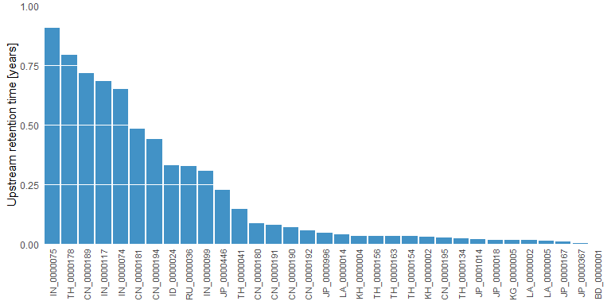
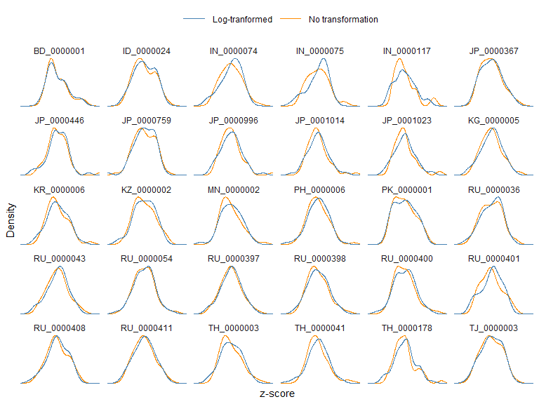
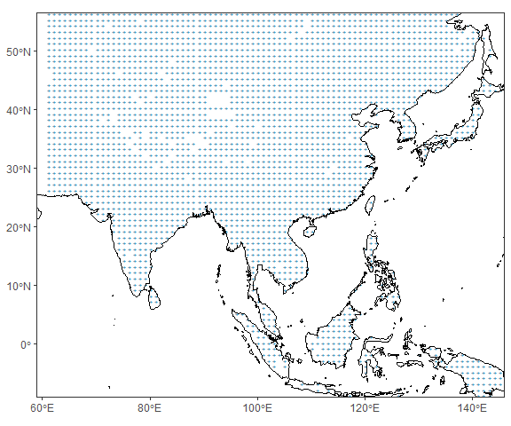
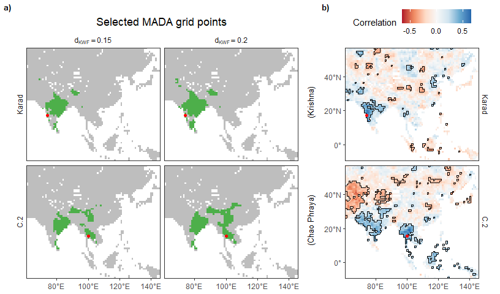
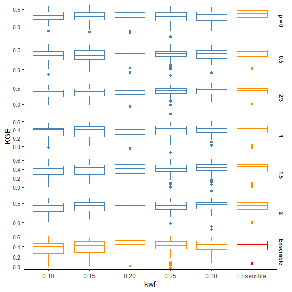
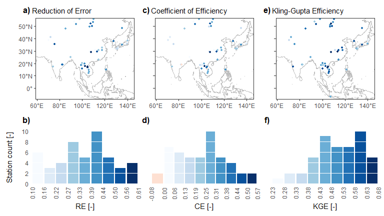
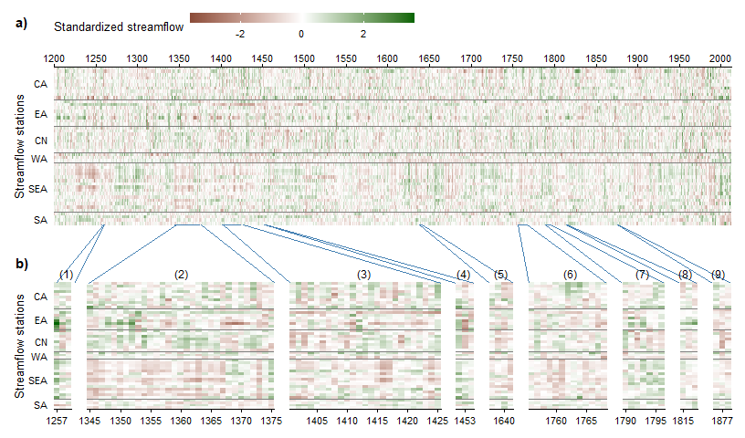
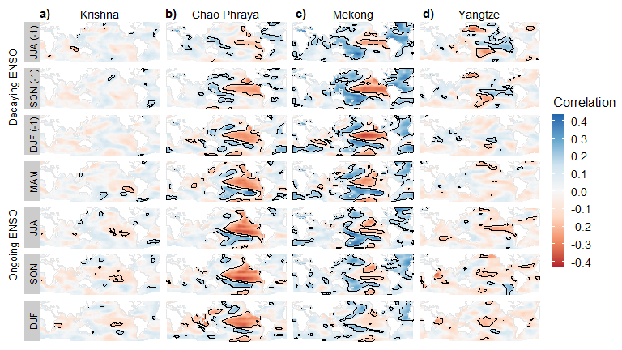

# Introduction

This repository contains the data and results to reproduce the paper by Nguyen et al., submitted to Water Resources Research. This vignette shows the step-by-step computations to reproduce the paper's results and figures. We also provide some additional details that may be of interest to some readers.

We provide the data in the folder `data/`. Unfortunately, we can't give you the instrumental streamflow data for the Yangtze, Mekong, and Pearl Rivers, due to restrictions. Therefore, if you run the code here, you will not get results for these rivers for some computations that require instrumental data. We provide all results in the folder `results/`, including those for these rivers. 

R scripts that contain the intermediate computational steps and utility functions are provided in the folder `R/`. You may want to check them out before we proceed.

We start by loading the necessary packages and utility functions.


```r
library(ldsr)                       # Streamflow reconstruction
library(data.table)                 # Data wrangling
library(ggplot2)                    # Plotting
library(patchwork)                  # Arrange plots
library(cowplot)                    # Arrange and annotate plots
library(foreach)                    # Parallel computations
library(magrittr)                   # Piping
source('R/geo_functions.R')         # Geographical processing functions
source('R/correlation_functions.R') # Correlation tools
source('R/utils.R')                 # Other utilities
options(digits = 4)                 # For concise printing
```

# Data

Let's read the main data.


```r
instQmeta <- fread('data/instQ_meta.csv', key = 'ID') # Streamflow metadata
instQ <- fread('data/instQ.csv', key = 'ID')          # Instrumental streamflow
mada2mat <- readRDS('data/mada2mat.RDS')              # MADA v2
mada2xy <- readRDS('data/mada2xy.RDS')                # Coordinates of MADA v2 grid points
```

Now let's explore the data sets.

## Streamflow data

### Metadata

Table S2.


```r
instQmeta
```

<div data-pagedtable="false">
  <script data-pagedtable-source type="application/json">
{"columns":[{"label":["ID"],"name":[1],"type":["chr"],"align":["left"]},{"label":["region"],"name":[2],"type":["chr"],"align":["left"]},{"label":["basin"],"name":[3],"type":["chr"],"align":["left"]},{"label":["river"],"name":[4],"type":["chr"],"align":["left"]},{"label":["name"],"name":[5],"type":["chr"],"align":["left"]},{"label":["code"],"name":[6],"type":["chr"],"align":["left"]},{"label":["long"],"name":[7],"type":["dbl"],"align":["right"]},{"label":["lat"],"name":[8],"type":["dbl"],"align":["right"]}],"data":[{"1":"BD_0000001","2":"SA","3":"Brahmaputra","4":"Brahmaputra","5":"Bahadurabad","6":"6SA01","7":"89.70","8":"25.179"},{"1":"CN_0000180","2":"CN","3":"Yangtze","4":"Yangtze","5":"Datong","6":"3CN08","7":"117.62","8":"30.771"},{"1":"CN_0000181","2":"CN","3":"Yangtze","4":"Huai He","5":"Bengbu","6":"3CN01","7":"117.36","8":"32.954"},{"1":"CN_0000189","2":"CN","3":"Pearl","4":"Dong Jiang","5":"Boluo","6":"3CN09","7":"114.30","8":"23.163"},{"1":"CN_0000190","2":"CN","3":"Yangtze","4":"Yangtze","5":"Cuntan","6":"3CN02","7":"106.60","8":"29.613"},{"1":"CN_0000191","2":"CN","3":"Yangtze","4":"Yangtze","5":"Hankou","6":"3CN07","7":"114.30","8":"30.579"},{"1":"CN_0000192","2":"CN","3":"Yangtze","4":"Yangtze","5":"Luoshan","6":"3CN06","7":"113.35","8":"29.688"},{"1":"CN_0000194","2":"CN","3":"Yangtze","4":"Yangtze","5":"Wulong","6":"3CN03","7":"107.76","8":"29.321"},{"1":"CN_0000195","2":"CN","3":"Yangtze","4":"Yangtze","5":"Yichang","6":"3CN05","7":"111.28","8":"30.696"},{"1":"ID_0000024","2":"SEA","3":"Citarum","4":"Citarum","5":"Citarum","6":"5SEA17","7":"107.29","8":"-6.731"},{"1":"IN_0000074","2":"SA","3":"Godavari","4":"Godavari","5":"Jagdalpur","6":"6SA04","7":"82.02","8":"19.113"},{"1":"IN_0000075","2":"SA","3":"Godavari","4":"Godavari","5":"Nowrangpur","6":"6SA05","7":"82.51","8":"19.196"},{"1":"IN_0000117","2":"SA","3":"Krishna","4":"Karad","5":"Karad","6":"6SA06","7":"74.19","8":"17.296"},{"1":"JP_0000367","2":"EA","3":"Mogami","4":"Mogami","5":"Inakudashi","6":"2EA04","7":"140.35","8":"38.481"},{"1":"JP_0000446","2":"EA","3":"Edogawa","4":"Edogawa","5":"Noda","6":"2EA05","7":"139.89","8":"35.987"},{"1":"JP_0000759","2":"EA","3":"Yuragawa","4":"Yuragawa","5":"Fukuchiyama","6":"2EA06","7":"135.13","8":"35.305"},{"1":"JP_0000996","2":"EA","3":"Sendaigawa","4":"Sendaigawa","5":"Onofuchi","6":"2EA09","7":"130.34","8":"31.863"},{"1":"JP_0001014","2":"EA","3":"Oyodo","4":"Oyodo","5":"Takaoka","6":"2EA08","7":"131.30","8":"31.955"},{"1":"JP_0001023","2":"EA","3":"Ono","4":"Ono","5":"Shirataki Bridge","6":"2EA07","7":"131.65","8":"33.164"},{"1":"KG_0000005","2":"WA","3":"Syr Darya","4":"Naryn","5":"Uch-Kurgan","6":"4WA01","7":"72.11","8":"41.154"},{"1":"KH_0000002","2":"SEA","3":"Mekong","4":"Mekong","5":"Kompong Cham","6":"5SEA12","7":"105.47","8":"11.996"},{"1":"KH_0000004","2":"SEA","3":"Mekong","4":"Mekong","5":"Stung Treng","6":"5SEA11","7":"105.95","8":"13.529"},{"1":"KR_0000006","2":"EA","3":"Han","4":"Soyang","5":"Soyanggang","6":"2EA10","7":"127.82","8":"37.946"},{"1":"KZ_0000002","2":"CA","3":"Irtysh","4":"Irtysh","5":"Buran","6":"1CA10","7":"85.22","8":"48.004"},{"1":"LA_0000001","2":"SEA","3":"Mekong","4":"Nam Khan","5":"Ban Mixay","6":"5SEA02","7":"102.18","8":"19.779"},{"1":"LA_0000002","2":"SEA","3":"Mekong","4":"Mekong","5":"Luang Prabang","6":"5SEA03","7":"102.14","8":"19.896"},{"1":"LA_0000005","2":"SEA","3":"Mekong","4":"Mekong","5":"Vientiane","6":"5SEA04","7":"102.61","8":"17.929"},{"1":"LA_0000014","2":"SEA","3":"Mekong","4":"Mekong","5":"Pakse","6":"5SEA10","7":"105.80","8":"15.113"},{"1":"MN_0000002","2":"CA","3":"Selenga","4":"Yeruu","5":"Yeruu","6":"1CA04","7":"106.65","8":"49.738"},{"1":"PH_0000006","2":"SEA","3":"Angat","4":"Angat","5":"Angat","6":"5SEA16","7":"121.20","8":"14.999"},{"1":"PK_0000001","2":"WA","3":"Indus","4":"Indus","5":"Kachora","6":"4WA03","7":"75.44","8":"35.462"},{"1":"RU_0000036","2":"EA","3":"Amur","4":"Amur","5":"Khabarovsk","6":"2EA01","7":"135.05","8":"48.446"},{"1":"RU_0000043","2":"CA","3":"Selenga","4":"Selenga","5":"Mostovoy","6":"1CA01","7":"107.50","8":"52.021"},{"1":"RU_0000054","2":"CA","3":"Yenisei","4":"Yenisei","5":"Kyzyl","6":"1CA09","7":"94.40","8":"51.721"},{"1":"RU_0000397","2":"CA","3":"Upper Angara","4":"Verkhnyaya Angara","5":"Verkhnyaya Zaimka","6":"1CA05","7":"110.15","8":"55.846"},{"1":"RU_0000398","2":"CA","3":"Upper Angara","4":"Barguzin","5":"Barguzin","6":"1CA06","7":"109.60","8":"53.596"},{"1":"RU_0000400","2":"CA","3":"Selenga","4":"Chikoy","5":"Gremyachka","6":"1CA03","7":"108.61","8":"50.313"},{"1":"RU_0000401","2":"CA","3":"Selenga","4":"Khilok","5":"Khailastuy","6":"1CA02","7":"106.99","8":"51.204"},{"1":"RU_0000408","2":"CA","3":"Yenisei","4":"Biryusa","5":"Biryusinsk","6":"1CA07","7":"97.78","8":"55.963"},{"1":"RU_0000411","2":"CA","3":"Yenisei","4":"Tuba","5":"Bugurtak","6":"1CA08","7":"92.87","8":"53.796"},{"1":"TH_0000003","2":"SEA","3":"Chao Phraya","4":"Nan","5":"N.1","6":"5SEA13","7":"100.78","8":"18.771"},{"1":"TH_0000041","2":"SEA","3":"Chao Phraya","4":"Ping","5":"P.1","6":"5SEA14","7":"99.00","8":"18.788"},{"1":"TH_0000134","2":"SEA","3":"Mekong","4":"Mekong","5":"Chiang Saen","6":"5SEA01","7":"100.10","8":"20.271"},{"1":"TH_0000154","2":"SEA","3":"Mekong","4":"Mekong","5":"Nakhon Phanom","6":"5SEA05","7":"104.79","8":"17.397"},{"1":"TH_0000156","2":"SEA","3":"Mekong","4":"Mekong","5":"Mukdahan","6":"5SEA08","7":"104.75","8":"16.538"},{"1":"TH_0000163","2":"SEA","3":"Mekong","4":"Nam Mun","5":"Ubon","6":"5SEA09","7":"104.86","8":"15.221"},{"1":"TH_0000178","2":"SEA","3":"Chao Phraya","4":"Chao Phraya","5":"C.2","6":"5SEA15","7":"100.11","8":"15.671"},{"1":"TJ_0000003","2":"WA","3":"Amu Darya","4":"Vakhsh","5":"Garm","6":"4WA02","7":"70.33","8":"39.004"}],"options":{"columns":{"min":{},"max":[10]},"rows":{"min":[12],"max":[12]},"pages":{}}}
  </script>
</div>

**Note.** In the paper, we omitted the leading zeros in station IDs due to space constraints. Here we are using the full station IDs. The column code is an encoding for plotting, which will be useful in Figure 5.

### Upstream resident time

Figure 1b.

We have calculated the total upstream reservoir capacity of each station from QGIS and stored in the file `data/resVol.csv`. We have also calculated the mean annual flow, converted it to million m$^3$/year, and stored in the file `data/instQmean.csv`. Now, we calculate upstream resident time as the ratio between the total upstream reservoir capacity and the mean annual flow.


```r
resVol <- fread('data/resVol.csv')
instQmean <- fread('data/instQmean.csv')
resFrac <- resVol[instQmean, on = 'ID', nomatch = NULL, # Merge
                ][, frac := resVol / Qm                 # Calculate ratio
                ][order(frac, decreasing = TRUE)        # Sort by frac
                ][, ID := factor(ID, levels = ID)]      # To maintain plot order
ggplot(resFrac, aes(ID, frac)) +
  geom_bar(fill = blues9[6], stat = 'identity') +
  scale_x_discrete(expand = c(0, 0)) +
  scale_y_continuous(expand = c(0, 0), breaks = seq(0, 1, by = 0.25), limits = c(0, 1)) +
  labs(x = NULL, y = 'Upstream retention time [years]') +
  theme_classic() +
  theme(axis.text.x = element_text(angle = 90, vjust = 0.5, hjust = 1, size = 8),
        axis.text.y = element_text(hjust = 0),
        axis.ticks = element_blank(),
        axis.line = element_blank(),
        panel.background = element_blank(),
        panel.grid.major.y = element_line(colour = 'white'),
        panel.grid.major.x = element_blank(),
        panel.grid.minor = element_blank(),
        panel.ontop = TRUE)
```

<!-- -->

### Density

Figure S3, without the Yangtze, Mekong, and Pearl. 

Rescale the untransformed and log-transformed flow, then compare the two densities.


```r
transQ <- instQ[, .(None = standardize(Qa), Log = standardize(log(Qa))), by = ID]
ggplot(transQ) +
  stat_density(aes(x = None, colour = 'No transformation'),
               position = 'identity', geom = 'line', na.rm = TRUE, size = 0.5) +
  stat_density(aes(x = Log, colour = 'Log-tranformed'),
               position = 'identity', geom = 'line', na.rm = TRUE, size = 0.5) +
  scale_x_continuous(expand = c(0, 0)) +
  scale_y_continuous(expand = c(0, 0)) +
  scale_colour_manual(name = NULL, 
                      values = c('steelblue', 'darkorange')) +
  facet_wrap(vars(ID), scales = 'free_y', ncol = 6) +
  labs(x = 'z-score', y = 'Density') +
  theme_classic() +
  theme(axis.text = element_blank(),
        axis.ticks = element_blank(),
        axis.line = element_blank(),
        strip.background = element_blank(),
        legend.position = 'top',
        legend.key.width = unit(1, 'cm'))
```

<!-- -->

## MADA v2

In case you are not familiar with the MADA, below is a plot of the grid. For background map, we also provide the coastlines of the Monsoon Asia region in the file `data/mada-coastline.gpkg`. We use the package `sf` to read this file.


```r
bgMap <- sf::st_read('data/mada-coastline.gpkg', quiet = TRUE)
ggplot(mada2xy) + 
  geom_point(aes(long, lat), shape = '+', colour = 'steelblue') +
  geom_sf(data = bgMap) +
  labs(x = NULL, y = NULL) +
  coord_sf(expand = FALSE) +
  theme_bw() +
  theme(panel.grid = element_blank())
```

<!-- -->

All MADA grid points end in 2012. We now plot their starting years. This is Figure S4.


```r
mada2startYear <- readRDS('data/mada2start.RDS')
ggplot(mada2startYear) +
  geom_raster(aes(long, lat, fill = year)) +
  scale_fill_binned(name = 'First year of record', type = 'viridis') +
  scale_x_continuous(expand = c(0, 0), labels = pasteLong) +
  scale_y_continuous(expand = c(0, 0), labels = pasteLat) +
  labs(x = NULL, y = NULL) +
  coord_quickmap() +
  theme_bw() +
  theme(panel.grid = element_blank())
```

<!-- -->

Most grid points start before 1200. A few grid points that start after 1200 are ignored.

# Climate-informed input variable selection

The main idea is to select MADA grid points that are in a similar climate to the streamflow station of interest. We characterize climate using the KWF hydroclimate system.

## KWF hydroclimate system

We provide the hydroclimate classification system in the file `data/kwf.RDS`, only for the Monsoon Asia domain.


```r
kwf <- readRDS('data/kwf.RDS')
head(kwf)
```

<div data-pagedtable="false">
  <script data-pagedtable-source type="application/json">
{"columns":[{"label":["long"],"name":[1],"type":["dbl"],"align":["right"]},{"label":["lat"],"name":[2],"type":["dbl"],"align":["right"]},{"label":["arid"],"name":[3],"type":["dbl"],"align":["right"]},{"label":["seas"],"name":[4],"type":["dbl"],"align":["right"]},{"label":["snow"],"name":[5],"type":["dbl"],"align":["right"]},{"label":["col"],"name":[6],"type":["chr"],"align":["left"]},{"label":["ID"],"name":[7],"type":["int"],"align":["right"]},{"label":["x1"],"name":[8],"type":["dbl"],"align":["right"]},{"label":["x2"],"name":[9],"type":["dbl"],"align":["right"]},{"label":["y1"],"name":[10],"type":["dbl"],"align":["right"]},{"label":["y2"],"name":[11],"type":["dbl"],"align":["right"]}],"data":[{"1":"61.25","2":"25.25","3":"0.9732","4":"0.1103","5":"0","6":"#F81C00","7":"1","8":"61","9":"61.5","10":"25.0","11":"25.5"},{"1":"61.25","2":"25.75","3":"0.9762","4":"0.1110","5":"0","6":"#F91C00","7":"2","8":"61","9":"61.5","10":"25.5","11":"26.0"},{"1":"61.25","2":"26.25","3":"0.9758","4":"0.1205","5":"0","6":"#F91F00","7":"3","8":"61","9":"61.5","10":"26.0","11":"26.5"},{"1":"61.25","2":"26.75","3":"0.9742","4":"0.1308","5":"0","6":"#F82100","7":"4","8":"61","9":"61.5","10":"26.5","11":"27.0"},{"1":"61.25","2":"27.25","3":"0.9754","4":"0.1239","5":"0","6":"#F92000","7":"5","8":"61","9":"61.5","10":"27.0","11":"27.5"},{"1":"61.25","2":"27.75","3":"0.9739","4":"0.1429","5":"0","6":"#F82400","7":"6","8":"61","9":"61.5","10":"27.5","11":"28.0"}],"options":{"columns":{"min":{},"max":[10]},"rows":{"min":[10],"max":[10]},"pages":{}}}
  </script>
</div>

`long` and `lat` are the coordinates of the grid point. `x1`, `x2`, `y1`, `y2` are the four corners of the grid cell, which will be used to determine the cell that contains any point on Earth. `arid`, `seas`, and `snow` are the three KWF indices: aridity, seasonality, and snow fraction. `col` is the RGB colour created from the three indices. 

Let's visualize this data set.


```r
ggplot(kwf) +
  geom_raster(aes(long, lat, fill = I(col))) +
  labs(x = NULL, y = NULL) +
  scale_x_continuous(labels = pasteLong) +
  scale_y_continuous(labels = pasteLat) +
  coord_quickmap(expand = FALSE) +
  theme_bw() +
  theme(panel.grid = element_blank())
```

<!-- -->

With this, we can identify the KWF cell of each MADA grid cell, so as to determine its climate. The MADA v2 has resolution $1^\circ \times 1^\circ$ and the KWF has resolution $0.5^\circ \times 0.5^\circ$. The MADA grid lies nicely on the KWF grid, so all we need to do is a simple left joint.


```r
madaKwfCells <- mada2xy[kwf, on = c('long', 'lat'), nomatch = NULL
                      ][, .(point, long, lat, arid, seas, snow)]
head(madaKwfCells)
```

<div data-pagedtable="false">
  <script data-pagedtable-source type="application/json">
{"columns":[{"label":["point"],"name":[1],"type":["int"],"align":["right"]},{"label":["long"],"name":[2],"type":["dbl"],"align":["right"]},{"label":["lat"],"name":[3],"type":["dbl"],"align":["right"]},{"label":["arid"],"name":[4],"type":["dbl"],"align":["right"]},{"label":["seas"],"name":[5],"type":["dbl"],"align":["right"]},{"label":["snow"],"name":[6],"type":["dbl"],"align":["right"]}],"data":[{"1":"1","2":"61.25","3":"26.25","4":"0.9758","5":"0.1205","6":"0"},{"1":"2","2":"61.25","3":"27.25","4":"0.9754","5":"0.1239","6":"0"},{"1":"3","2":"61.25","3":"28.25","4":"0.9763","5":"0.1458","6":"0"},{"1":"4","2":"61.25","3":"29.25","4":"0.9769","5":"0.1652","6":"0"},{"1":"5","2":"61.25","3":"30.25","4":"0.9802","5":"0.1475","6":"0"},{"1":"6","2":"61.25","3":"31.25","4":"0.9696","5":"0.1996","6":"0"}],"options":{"columns":{"min":{},"max":[10]},"rows":{"min":[10],"max":[10]},"pages":{}}}
  </script>
</div>

## Select MADA grid points

From here on, we'll need to use lots of parallel computing, so let's set this up.


```r
doFuture::registerDoFuture()
future::plan(future::multiprocess)
```
Now we can select MADA grid points based on the KWF distance, using `get_mada_by_kwf()`. This will take a few seconds on a normal desktop. 


```r
kwfRange <- seq(0.1, 0.3, 0.05)
madaPoints <- foreach(s = split(instQmeta, by = 'ID')) %dopar%
  lapply(kwfRange, function(kwfMax) 
    get_mada_by_kwf(c(s$long, s$lat), madaKwfCells, kwf, kwfMax, 2500))
```

Alternatively, you can read the pre-computed results.


```r
madaPoints <- readRDS('results/madaPoints.RDS')
```

Let's now calculate the correlation between streamflow and the MADA for the selected stations on the Krishna and Chao Phraya (as in the paper), so that we can compare the significantly correlated areas with the search area, like in Figure 3. The file `R/correlation_functions.R` contains a utitilty function to determine the boundary lines of significant areas.


```r
# Correlation between PDSI and streamflow
group1 <- c('Krishna', 'Chao Phraya')
group1ID <- c('IN_0000117', 'TH_0000178')
row.names(mada2mat) <- 1200:2012
madaLong <- 
  mada2mat %>% 
  as.data.table(keep.rownames = 'year') %>% 
  melt(id.vars = 'year', variable.name = 'point', value.name = 'pdsi') %>% 
  .[, year := as.numeric(year)]
subCor <- merge(madaLong, instQ[group1ID], by = 'year')[, 
    {
      ct <- cor.test(pdsi, Qa)
      list(rho = ct$estimate, p.value = ct$p.value)
    },
    by = .(ID, point)
  ][, point := as.numeric(point) # melt() returns factor for variable so this is ok
  ][mada2xy, on = 'point'
  ][instQmeta[, .(ID, river, name, long, lat)], on = 'ID', nomatch = NULL]
setnames(subCor, c('i.long', 'i.lat'), c('Qlong', 'Qlat'))

subCor[, name := factor(name, levels = c('Karad', 'C.2'))]
subCor[, signif := p.value < 0.05]
setkey(subCor, long, lat)
subCorSignif <- subCor[, signif_area(.SD, 1, 1), by = .(ID, name)]

names(group1ID) <- group1ID
# Seach area
names(kwfNames) <- kwfNames <- c('0.10', '0.15', '0.20', '0.25', '0.30')

inputPoints <- 
  lapplyrbind(group1ID, function(s) 
    lapplyrbind(kwfNames[2:3], function(kwfMax) 
      data.table(point = madaPoints[[s]][[kwfMax]]),
      id = 'kwf'),
    id = 'ID'
  )[instQmeta[, .(ID, name)], on = 'ID', nomatch = NULL
  ][mada2xy, on = 'point', nomatch = NULL]
# Plots
inputPoints[, kwf := paste0('d[KWF] == ', kwf)]
inputPoints$name %<>% factor(levels = c('Karad', 'C.2'))

sxy <- instQmeta[group1ID][, name := factor(name, levels = c('Karad', 'C.2'))]
```

We're now ready to reproduce Figure 3.


```r
selectedPointPlot <- ggplot(inputPoints, aes(long, lat)) +
  geom_tile(data = mada2xy, width = 1, height = 1, fill = 'gray') +
  geom_tile(fill = '#4daf4a', width = 1, height = 1) +
  geom_point(data = sxy, colour = 'red') +
  scale_x_continuous(expand = c(0, 0), labels = pasteLong) +
  scale_y_continuous(expand = c(0, 0), position = 'right') +
  coord_quickmap() +
  facet_grid(name ~ kwf, switch = 'y',
             labeller = labeller(kwf = label_parsed)) +
  theme_bw() +
  theme(axis.ticks.y = element_blank(),
        axis.text.y = element_blank(),
        axis.line = element_blank(),
        axis.title = element_blank(),
        strip.background = element_blank(),
        panel.grid = element_blank(),
        plot.title = element_text(hjust = 0.5)) +
  labs(title = 'Selected MADA grid points')

corPlot <- ggplot(subCor) +
  geom_raster(aes(long, lat, fill = rho)) +
  geom_segment(aes(x = long - 0.5, xend = long + 0.5, y = lat + 0.5, yend = lat + 0.5),
               size = 0.1,
               data = subCorSignif[top == TRUE]) +
  geom_segment(aes(x = long - 0.5, xend = long + 0.5, y = lat - 0.5, yend = lat - 0.5),
               size = 0.1,
               data = subCorSignif[bottom == TRUE]) +
  geom_segment(aes(x = long - 0.5, xend = long - 0.5, y = lat - 0.5, yend = lat + 0.5),
               size = 0.1,
               data = subCorSignif[left == TRUE]) +
  geom_segment(aes(x = long + 0.5, xend = long + 0.5, y = lat - 0.5, yend = lat + 0.5),
               size = 0.1,
               data = subCorSignif[right == TRUE]) +
  geom_point(aes(Qlong, Qlat), colour = 'red') +
  scale_x_continuous(expand = c(0, 0), labels = pasteLong) +
  scale_y_continuous(expand = c(0, 0), labels = pasteLat) +
  scale_fill_distiller(name = 'Correlation', palette = 'RdBu', direction = 1, 
                       breaks = scales::pretty_breaks(3), limits = absRange(subCor$rho)) +
  coord_quickmap() +
  labs(x = NULL, y = NULL) +
  facet_wrap(~name, ncol = 1, strip.position = 'right') +
  theme_bw() +
  theme(panel.grid = element_blank(),
        axis.line = element_blank(),
        legend.position = 'top',
        legend.key.width = unit(0.6, 'cm'),
        strip.background = element_blank())

s2 <- plot_grid(selectedPointPlot, corPlot, 
                ncol = 2, align = 'hv', axis = 'trbl', rel_widths = c(1.75, 1),
                labels = c('a)', 'b)'), label_size = 10)

s2a <- ggdraw(s2) +
  draw_label('(Krishna)',     0.62, 0.650, size = 10, angle = 90) +
  draw_label('(Chao Phraya)', 0.62, 0.250, size = 10, angle = 90)
s2a
```

<!-- -->

## Weighted Principal Component Analysis

We need to calculate the correlation between each grid cell and each station. The result is a correlation matrix, each row is a station and each column is a MADA grid point.


```r
corMat <- 
  instQ[, 
        {
          ind <- which(1200:2012 %in% year)
          as.data.frame(cor(Qa, mada2mat[ind, ], use = 'complete.obs'))
        },
        keyby = ID] %>% 
  as.matrix(rownames = TRUE)
```

We also need to setup the p parameter, and do some small preparations.


```r
pRange <- c('0' = 0, '0.5' = 0.5, '2/3' = 2/3, '1' = 1, '1.5' = 1.5, '2' = 2)
stationIDs <- instQmeta[ID %in% instQ$ID, ID]
# Set names so that we can name list elements conveniently later
names(pNames) <- pNames <- names(pRange) 
names(stationIDs) <- stationIDs 
```


```r
pca <- 
  foreach(s = stationIDs, 
          .final = function(x) setNames(x, stationIDs)) %dopar% {
    lapply(kwfNames, function(kwfMax) {
      points <- madaPoints[[s]][[kwfMax]]
      X <- mada2mat[, points]
      rho <- corMat[s, points]
      lapply(pRange, function(p) {
        pcaModel <- wPCA(X, rho, p)
        get_PCs(pcaModel)
      })
    })  
  }
```

The previous step gives us a 30-member ensemble from 5 KWF distance and 6 PCA weights. You can type `View(pca)` to see the results. Each ensemble member contains a set of weighted PCs.

Next, use the VSURF algorithm to select a subset of principal components for each ensemble. This code will take about 20 minutes, so get yourself a drink while it runs. Or skip to the next chunk and read the pre-computed results.


```r
ivs <- 
  foreach(s = stationIDs, 
          .packages = 'data.table',
          .final = function(x) setNames(x, stationIDs)) %:%
    foreach(kwfMax = kwfNames,
            .final = function(x) setNames(x, kwfNames)) %:%
      foreach(p = pNames,
              .final = function(x) setNames(x, pNames)) %dopar% {
        Qa <- instQ[s][!is.na(Qa)]
        idx <- which(1200:2012 %in% Qa$year)
        input_selection(pca[[s]][[kwfMax]][[p]][idx], Qa$Qa, 
                        nvmax = 8, method = 'VSURF', parallel = FALSE)
      }
```


```r
ivs <- readRDS('results/ivs.RDS')
```

`ivs` contains the names of the selected PCs. Type `View(ivs)` to see its content.

Finally, we combine `pca` and `ivs` to have an ensemble of selected PCs. 


```r
ensemblePCs <- 
  lapply(stationIDs, function(s) 
    lapply(kwfNames, function(kwfMax) 
      lapply(pNames, function(p) {
        sv <- ivs[[s]][[kwfMax]][[p]]
        pca[[s]][[kwfMax]][[p]][, ..sv]  
      })))
```

If you skipped the computations above, you can read the pre-computed weight PCA ensembles here.


```r
ensemblePCs <- readRDS('results/ensemblePCs.RDS')
```

# Cross-validation

This cross-validation step is also a tuning step. We cross-validate all ensemble members and select one that has the highest mean KGE.

We will also check ensemble averaged models where we average over all p, over all kwf distances, and over both p and kwf. 

Before we start, we need to make the cross-validation folds. 


```r
set.seed(100)
cvPoints <- 
  instQ %>% 
    split(by = 'ID') %>% 
    lapply('[[', 'Qa') %>% 
    lapply(make_Z, frac = 0.25, nRuns = 30, contiguous = TRUE)
```

We also need to determine whether streamflow needs to be log-transformed for each station.


```r
trans <- instQ[, .(trans = ifelse(abs(hinkley(log(Qa))) < abs(hinkley(Qa)), 'log', 'none')), 
               by = ID]
```

Running the above line of code now only gives you 30 stations, so we provided the precomputed one.


```r
trans <- fread('data/transType.csv', key = 'ID')
```

This code takes many hours to run, so you should only run it on a server (one that has 24-32 cores or so), or on a cluster.


```r
ldsScores <- 
  foreach(s = stationIDs,
          .packages = c('data.table', 'ldsr'),
          .final = function(x) {
            names(x) <- stationIDs
            rbindlist(x, idcol = 'ID')
          }) %dopar% {
      Qa <- instQ[s]
      Z <- cvPoints[[s]]
      transform <- trans[s, trans]
      obs <- if (transform == 'log') log(Qa$Qa) else Qa$Qa
      mu <- mean(obs, na.rm = TRUE)
      instPeriod <- which(1200:2012 %in% Qa$year)
      y <- t(c(rep(NA, Qa[1, year] - 1200),   # Before the instrumental period
               obs - mu,                      # Instrumental period
               rep(NA, 2012 - Qa[.N, year]))) # After the instrumental period
      # Individual models
      Ycv <- lapplyrbind(kwfNames, function(kwfMax) 
               lapplyrbind(pNames, function(p) {
                 u <- t(ensemblePCs[[s]][[kwfMax]][[p]])
                 lapplyrbind(Z, function(z) 
                   data.table(year = Qa$year,
                              Q = one_lds_cv(z, instPeriod, 
                                             mu, y, u, u, 'EM', num.restarts))) 
              }))
      colnames(Ycv)[1:3] <- c('kwf', 'p', 'rep')
      # Different ensembles
      ensP <- Ycv[, .(p = 'Ensemble', Q = mean(Q)), by = .(kwf, rep, year)]
      ensKWF <- Ycv[, .(kwf = 'Ensemble', Q = mean(Q)), by = .(p, rep, year)]
      ens <- Ycv[, .(p = 'Ensemble', kwf = 'Ensemble', Q = mean(Q)), by = .(rep, year)]
      # Merge & calculate scores
      Ycv <- rbind(Ycv, ensP, ensKWF, ens)
      scores <- Ycv[, 
                    {
                      Q <- if (transform == 'log') exp(Q) else Q
                      metrics <- calculate_metrics(Q, Qa$Qa, Z[[rep]])
                      data.table(metric = names(metrics), value = metrics)
                    },
                    by = .(kwf, p, rep)
                  ][, .(value = mean(value)), by = .(kwf, p, metric)]
      out <- list(Ycv = Ycv, scores = scores)
      scores
    }
ldsScores[, type := fifelse(kwf == 'Ensemble' & p == 'Ensemble', 
                                    'both',
                                    fifelse(kwf == 'Ensemble' | p == 'Ensemble',
                                            'one', 
                                            'none'))]
ldsScores[, p := factor(p, levels = c(pNames, 'Ensemble'))]
```


```r
ldsScores <- readRDS('results/ldsScores.RDS')
```

Let's plot the distribution of KGE


```r
pasteP <- function(x) ifelse(x == '0', paste('p =', x), x)
ggplot(ldsScores[metric == 'KGE']) +
  geom_boxplot(aes(kwf, value, colour = type),
               position = position_dodge2(padding = 0.25)) +
  scale_colour_manual(name = NULL, values = c('red', 'steelblue', 'darkorange'), 
                      guide = 'none') +
  scale_fill_manual(name = 'Metric space', values = c(NA, 'gray90')) +
  scale_y_continuous(breaks = scales::pretty_breaks(3)) +
  facet_grid(vars(p), scales = 'free_y', labeller = labeller(.rows = pasteP)) +
  theme_classic() +
  labs(y = 'KGE') +
  theme(legend.position = 'none',
        strip.background = element_blank(),
        strip.text.x = element_blank(),
        strip.text.y = element_text(face = 'bold', size = 8),
        axis.text.y = element_text(size = 8))
```

<!-- -->

Averaging over the ensemble does not improve the socres significantly, and it breaks the state-streamflow relationship. So we use the best member instead of the ensemble average.

Let's now select the best ensemble member and check the KGE value of the selected ones.


```r
ldsChoice <- ldsScores[metric == 'KGE' & type == 'none',
                       .SD[value == max(value)], 
                       by = ID,
                      .SDcols = c('kwf', 'p', 'value')]
setnames(ldsChoice, 'value', 'KGE')
setkey(ldsChoice, ID)
ldsChoice
```

<div data-pagedtable="false">
  <script data-pagedtable-source type="application/json">
{"columns":[{"label":["ID"],"name":[1],"type":["chr"],"align":["left"]},{"label":["kwf"],"name":[2],"type":["chr"],"align":["left"]},{"label":["p"],"name":[3],"type":["fctr"],"align":["left"]},{"label":["KGE"],"name":[4],"type":["dbl"],"align":["right"]}],"data":[{"1":"BD_0000001","2":"0.20","3":"0.5","4":"0.4536"},{"1":"CN_0000180","2":"0.20","3":"0.5","4":"0.5560"},{"1":"CN_0000181","2":"0.20","3":"1","4":"0.5848"},{"1":"CN_0000189","2":"0.30","3":"2","4":"0.5110"},{"1":"CN_0000190","2":"0.25","3":"0.5","4":"0.2317"},{"1":"CN_0000191","2":"0.30","3":"0.5","4":"0.5811"},{"1":"CN_0000192","2":"0.30","3":"2/3","4":"0.6484"},{"1":"CN_0000194","2":"0.30","3":"2","4":"0.6435"},{"1":"CN_0000195","2":"0.30","3":"0.5","4":"0.3624"},{"1":"ID_0000024","2":"0.30","3":"2","4":"0.4432"},{"1":"IN_0000074","2":"0.30","3":"2","4":"0.4419"},{"1":"IN_0000075","2":"0.20","3":"1.5","4":"0.4115"},{"1":"IN_0000099","2":"0.10","3":"0","4":"0.5263"},{"1":"IN_0000117","2":"0.30","3":"1.5","4":"0.5798"},{"1":"JP_0000018","2":"0.30","3":"0.5","4":"0.2123"},{"1":"JP_0000167","2":"0.25","3":"1","4":"0.5694"},{"1":"JP_0000367","2":"0.15","3":"1.5","4":"0.3152"},{"1":"JP_0000446","2":"0.30","3":"2/3","4":"0.4629"},{"1":"JP_0000759","2":"0.25","3":"0.5","4":"0.5829"},{"1":"JP_0000996","2":"0.20","3":"0","4":"0.4325"},{"1":"JP_0001014","2":"0.30","3":"1","4":"0.4138"},{"1":"JP_0001023","2":"0.30","3":"0.5","4":"0.3135"},{"1":"KG_0000005","2":"0.20","3":"0.5","4":"0.4732"},{"1":"KH_0000002","2":"0.10","3":"0.5","4":"0.5480"},{"1":"KH_0000004","2":"0.25","3":"0.5","4":"0.5854"},{"1":"KR_0000005","2":"0.25","3":"0.5","4":"0.5477"},{"1":"KR_0000006","2":"0.30","3":"1.5","4":"0.5863"},{"1":"KZ_0000002","2":"0.30","3":"0.5","4":"0.5742"},{"1":"LA_0000001","2":"0.20","3":"2","4":"0.4331"},{"1":"LA_0000002","2":"0.15","3":"2","4":"0.5087"},{"1":"LA_0000005","2":"0.15","3":"2","4":"0.5857"},{"1":"LA_0000014","2":"0.30","3":"0.5","4":"0.5623"},{"1":"MN_0000002","2":"0.20","3":"0.5","4":"0.5288"},{"1":"PH_0000006","2":"0.20","3":"1.5","4":"0.4318"},{"1":"PK_0000001","2":"0.30","3":"0.5","4":"0.4793"},{"1":"RU_0000036","2":"0.20","3":"1.5","4":"0.5499"},{"1":"RU_0000043","2":"0.30","3":"2","4":"0.6491"},{"1":"RU_0000054","2":"0.15","3":"0","4":"0.6076"},{"1":"RU_0000397","2":"0.20","3":"2","4":"0.5503"},{"1":"RU_0000398","2":"0.20","3":"2/3","4":"0.4929"},{"1":"RU_0000400","2":"0.30","3":"2","4":"0.5820"},{"1":"RU_0000401","2":"0.30","3":"0.5","4":"0.4854"},{"1":"RU_0000408","2":"0.10","3":"0.5","4":"0.5263"},{"1":"RU_0000411","2":"0.30","3":"0","4":"0.3935"},{"1":"TH_0000003","2":"0.30","3":"0","4":"0.4082"},{"1":"TH_0000041","2":"0.20","3":"2/3","4":"0.4321"},{"1":"TH_0000134","2":"0.20","3":"2/3","4":"0.5037"},{"1":"TH_0000154","2":"0.20","3":"2/3","4":"0.6772"},{"1":"TH_0000156","2":"0.10","3":"0.5","4":"0.6532"},{"1":"TH_0000163","2":"0.25","3":"2/3","4":"0.4058"},{"1":"TH_0000178","2":"0.20","3":"1","4":"0.5983"},{"1":"TJ_0000003","2":"0.30","3":"2/3","4":"0.3379"}],"options":{"columns":{"min":{},"max":[10]},"rows":{"min":[12],"max":[12]},"pages":{}}}
  </script>
</div>

Next, we do the following steps

* Merge this selection to the full ensemble scores to get all the skill scores of the selected members.
* Keep only the relevant columns
* Convert to wide format
* Merge with the metadata table to get the coordinates


```r
scores <- ldsScores[ldsChoice, on = c('ID', 'kwf', 'p')
                  ][, .(ID, metric, value)
                  ][, dcast(.SD, ID ~ metric)
                  ][instQmeta, on = 'ID']
scores
```

<div data-pagedtable="false">
  <script data-pagedtable-source type="application/json">
{"columns":[{"label":["ID"],"name":[1],"type":["chr"],"align":["left"]},{"label":["CE"],"name":[2],"type":["dbl"],"align":["right"]},{"label":["KGE"],"name":[3],"type":["dbl"],"align":["right"]},{"label":["R2"],"name":[4],"type":["dbl"],"align":["right"]},{"label":["RE"],"name":[5],"type":["dbl"],"align":["right"]},{"label":["nRMSE"],"name":[6],"type":["dbl"],"align":["right"]},{"label":["region"],"name":[7],"type":["chr"],"align":["left"]},{"label":["basin"],"name":[8],"type":["chr"],"align":["left"]},{"label":["river"],"name":[9],"type":["chr"],"align":["left"]},{"label":["name"],"name":[10],"type":["chr"],"align":["left"]},{"label":["code"],"name":[11],"type":["chr"],"align":["left"]},{"label":["long"],"name":[12],"type":["dbl"],"align":["right"]},{"label":["lat"],"name":[13],"type":["dbl"],"align":["right"]}],"data":[{"1":"BD_0000001","2":"0.02033","3":"0.4536","4":"0.6054","5":"0.3272","6":"0.10842","7":"SA","8":"Brahmaputra","9":"Brahmaputra","10":"Bahadurabad","11":"6SA01","12":"89.70","13":"25.179"},{"1":"CN_0000180","2":"0.26274","3":"0.5560","4":"0.5833","5":"0.3853","6":"0.11105","7":"CN","8":"Yangtze","9":"Yangtze","10":"Datong","11":"3CN08","12":"117.62","13":"30.771"},{"1":"CN_0000181","2":"0.25335","3":"0.5848","4":"0.6249","5":"0.2955","6":"0.46033","7":"CN","8":"Yangtze","9":"Huai He","10":"Bengbu","11":"3CN01","12":"117.36","13":"32.954"},{"1":"CN_0000189","2":"0.25823","3":"0.5110","4":"0.8597","5":"0.3246","6":"0.19334","7":"CN","8":"Pearl","9":"Dong Jiang","10":"Boluo","11":"3CN09","12":"114.30","13":"23.163"},{"1":"CN_0000190","2":"0.06448","3":"0.2317","4":"0.3938","5":"0.1439","6":"0.11312","7":"CN","8":"Yangtze","9":"Yangtze","10":"Cuntan","11":"3CN02","12":"106.60","13":"29.613"},{"1":"CN_0000191","2":"0.24748","3":"0.5811","4":"0.5955","5":"0.2967","6":"0.09498","7":"CN","8":"Yangtze","9":"Yangtze","10":"Hankou","11":"3CN07","12":"114.30","13":"30.579"},{"1":"CN_0000192","2":"0.48415","3":"0.6484","4":"0.6954","5":"0.5107","6":"0.06809","7":"CN","8":"Yangtze","9":"Yangtze","10":"Luoshan","11":"3CN06","12":"113.35","13":"29.688"},{"1":"CN_0000194","2":"0.56608","3":"0.6435","4":"0.9290","5":"0.5916","6":"0.11894","7":"CN","8":"Yangtze","9":"Yangtze","10":"Wulong","11":"3CN03","12":"107.76","13":"29.321"},{"1":"CN_0000195","2":"0.04086","3":"0.3624","4":"0.4415","5":"0.1080","6":"0.10497","7":"CN","8":"Yangtze","9":"Yangtze","10":"Yichang","11":"3CN05","12":"111.28","13":"30.696"},{"1":"ID_0000024","2":"0.04005","3":"0.4432","4":"0.4303","5":"0.1380","6":"0.18471","7":"SEA","8":"Citarum","9":"Citarum","10":"Citarum","11":"5SEA17","12":"107.29","13":"-6.731"},{"1":"IN_0000074","2":"0.14803","3":"0.4419","4":"0.6917","5":"0.4973","6":"0.28795","7":"SA","8":"Godavari","9":"Godavari","10":"Jagdalpur","11":"6SA04","12":"82.02","13":"19.113"},{"1":"IN_0000075","2":"-0.07646","3":"0.4115","4":"0.8053","5":"0.4821","6":"0.36297","7":"SA","8":"Godavari","9":"Godavari","10":"Nowrangpur","11":"6SA05","12":"82.51","13":"19.196"},{"1":"IN_0000117","2":"0.22358","3":"0.5798","4":"0.7710","5":"0.3140","6":"0.28488","7":"SA","8":"Krishna","9":"Karad","10":"Karad","11":"6SA06","12":"74.19","13":"17.296"},{"1":"JP_0000367","2":"0.02884","3":"0.3152","4":"0.3814","5":"0.3155","6":"0.12359","7":"EA","8":"Mogami","9":"Mogami","10":"Inakudashi","11":"2EA04","12":"140.35","13":"38.481"},{"1":"JP_0000446","2":"0.06358","3":"0.4629","4":"0.5553","5":"0.2308","6":"0.18210","7":"EA","8":"Edogawa","9":"Edogawa","10":"Noda","11":"2EA05","12":"139.89","13":"35.987"},{"1":"JP_0000759","2":"0.37131","3":"0.5829","4":"0.5907","5":"0.4057","6":"0.15266","7":"EA","8":"Yuragawa","9":"Yuragawa","10":"Fukuchiyama","11":"2EA06","12":"135.13","13":"35.305"},{"1":"JP_0000996","2":"0.24699","3":"0.4325","4":"0.6532","5":"0.2720","6":"0.21181","7":"EA","8":"Sendaigawa","9":"Sendaigawa","10":"Onofuchi","11":"2EA09","12":"130.34","13":"31.863"},{"1":"JP_0001014","2":"0.19648","3":"0.4138","4":"0.5943","5":"0.2504","6":"0.23287","7":"EA","8":"Oyodo","9":"Oyodo","10":"Takaoka","11":"2EA08","12":"131.30","13":"31.955"},{"1":"JP_0001023","2":"0.06968","3":"0.3135","4":"0.5428","5":"0.1667","6":"0.25789","7":"EA","8":"Ono","9":"Ono","10":"Shirataki Bridge","11":"2EA07","12":"131.65","13":"33.164"},{"1":"KG_0000005","2":"0.07048","3":"0.4732","4":"0.7737","5":"0.2570","6":"0.20844","7":"WA","8":"Syr Darya","9":"Naryn","10":"Uch-Kurgan","11":"4WA01","12":"72.11","13":"41.154"},{"1":"KH_0000002","2":"0.26471","3":"0.5480","4":"0.9451","5":"0.3863","6":"0.10012","7":"SEA","8":"Mekong","9":"Mekong","10":"Kompong Cham","11":"5SEA12","12":"105.47","13":"11.996"},{"1":"KH_0000004","2":"0.25375","3":"0.5854","4":"0.7145","5":"0.3610","6":"0.12084","7":"SEA","8":"Mekong","9":"Mekong","10":"Stung Treng","11":"5SEA11","12":"105.95","13":"13.529"},{"1":"KR_0000006","2":"0.40848","3":"0.5863","4":"0.8198","5":"0.4633","6":"0.22803","7":"EA","8":"Han","9":"Soyang","10":"Soyanggang","11":"2EA10","12":"127.82","13":"37.946"},{"1":"KZ_0000002","2":"0.20485","3":"0.5742","4":"0.8317","5":"0.3522","6":"0.22600","7":"CA","8":"Irtysh","9":"Irtysh","10":"Buran","11":"1CA10","12":"85.22","13":"48.004"},{"1":"LA_0000001","2":"0.26449","3":"0.4331","4":"0.5191","5":"0.3973","6":"0.22008","7":"SEA","8":"Mekong","9":"Nam Khan","10":"Ban Mixay","11":"5SEA02","12":"102.18","13":"19.779"},{"1":"LA_0000002","2":"0.28421","3":"0.5087","4":"0.5826","5":"0.4148","6":"0.11943","7":"SEA","8":"Mekong","9":"Mekong","10":"Luang Prabang","11":"5SEA03","12":"102.14","13":"19.896"},{"1":"LA_0000005","2":"0.52821","3":"0.5857","4":"0.5072","5":"0.6134","6":"0.09308","7":"SEA","8":"Mekong","9":"Mekong","10":"Vientiane","11":"5SEA04","12":"102.61","13":"17.929"},{"1":"LA_0000014","2":"0.30017","3":"0.5623","4":"0.7072","5":"0.4066","6":"0.11560","7":"SEA","8":"Mekong","9":"Mekong","10":"Pakse","11":"5SEA10","12":"105.80","13":"15.113"},{"1":"MN_0000002","2":"0.13519","3":"0.5288","4":"0.6604","5":"0.3996","6":"0.29403","7":"CA","8":"Selenga","9":"Yeruu","10":"Yeruu","11":"1CA04","12":"106.65","13":"49.738"},{"1":"PH_0000006","2":"0.31727","3":"0.4318","4":"0.4666","5":"0.4282","6":"0.21945","7":"SEA","8":"Angat","9":"Angat","10":"Angat","11":"5SEA16","12":"121.20","13":"14.999"},{"1":"PK_0000001","2":"0.13996","3":"0.4793","4":"0.6971","5":"0.5234","6":"0.12486","7":"WA","8":"Indus","9":"Indus","10":"Kachora","11":"4WA03","12":"75.44","13":"35.462"},{"1":"RU_0000036","2":"0.17677","3":"0.5499","4":"0.5677","5":"0.4219","6":"0.17937","7":"EA","8":"Amur","9":"Amur","10":"Khabarovsk","11":"2EA01","12":"135.05","13":"48.446"},{"1":"RU_0000043","2":"0.47959","3":"0.6491","4":"0.8749","5":"0.5479","6":"0.14208","7":"CA","8":"Selenga","9":"Selenga","10":"Mostovoy","11":"1CA01","12":"107.50","13":"52.021"},{"1":"RU_0000054","2":"0.37763","3":"0.6076","4":"0.9819","5":"0.4044","6":"0.09826","7":"CA","8":"Yenisei","9":"Yenisei","10":"Kyzyl","11":"1CA09","12":"94.40","13":"51.721"},{"1":"RU_0000397","2":"0.32163","3":"0.5503","4":"0.4783","5":"0.3494","6":"0.11183","7":"CA","8":"Upper Angara","9":"Verkhnyaya Angara","10":"Verkhnyaya Zaimka","11":"1CA05","12":"110.15","13":"55.846"},{"1":"RU_0000398","2":"0.28295","3":"0.4929","4":"0.4046","5":"0.3986","6":"0.16323","7":"CA","8":"Upper Angara","9":"Barguzin","10":"Barguzin","11":"1CA06","12":"109.60","13":"53.596"},{"1":"RU_0000400","2":"0.33567","3":"0.5820","4":"0.7062","5":"0.4485","6":"0.20481","7":"CA","8":"Selenga","9":"Chikoy","10":"Gremyachka","11":"1CA03","12":"108.61","13":"50.313"},{"1":"RU_0000401","2":"0.02793","3":"0.4854","4":"0.7630","5":"0.1345","6":"0.32700","7":"CA","8":"Selenga","9":"Khilok","10":"Khailastuy","11":"1CA02","12":"106.99","13":"51.204"},{"1":"RU_0000408","2":"0.27206","3":"0.5263","4":"0.6239","5":"0.2932","6":"0.15369","7":"CA","8":"Yenisei","9":"Biryusa","10":"Biryusinsk","11":"1CA07","12":"97.78","13":"55.963"},{"1":"RU_0000411","2":"0.02619","3":"0.3935","4":"0.8124","5":"0.1036","6":"0.14968","7":"CA","8":"Yenisei","9":"Tuba","10":"Bugurtak","11":"1CA08","12":"92.87","13":"53.796"},{"1":"TH_0000003","2":"0.11297","3":"0.4082","4":"0.5599","5":"0.2092","6":"0.28840","7":"SEA","8":"Chao Phraya","9":"Nan","10":"N.1","11":"5SEA13","12":"100.78","13":"18.771"},{"1":"TH_0000041","2":"0.18771","3":"0.4321","4":"0.6283","5":"0.4219","6":"0.28340","7":"SEA","8":"Chao Phraya","9":"Ping","10":"P.1","11":"5SEA14","12":"99.00","13":"18.788"},{"1":"TH_0000134","2":"0.03014","3":"0.5037","4":"0.6991","5":"0.2788","6":"0.11844","7":"SEA","8":"Mekong","9":"Mekong","10":"Chiang Saen","11":"5SEA01","12":"100.10","13":"20.271"},{"1":"TH_0000154","2":"0.43041","3":"0.6772","4":"0.7403","5":"0.5747","6":"0.11323","7":"SEA","8":"Mekong","9":"Mekong","10":"Nakhon Phanom","11":"5SEA05","12":"104.79","13":"17.397"},{"1":"TH_0000156","2":"0.40874","3":"0.6532","4":"0.8680","5":"0.5603","6":"0.10162","7":"SEA","8":"Mekong","9":"Mekong","10":"Mukdahan","11":"5SEA08","12":"104.75","13":"16.538"},{"1":"TH_0000163","2":"-0.01299","3":"0.4058","4":"0.5709","5":"0.2142","6":"0.30637","7":"SEA","8":"Mekong","9":"Nam Mun","10":"Ubon","11":"5SEA09","12":"104.86","13":"15.221"},{"1":"TH_0000178","2":"0.36603","3":"0.5983","4":"0.9710","5":"0.4883","6":"0.21348","7":"SEA","8":"Chao Phraya","9":"Chao Phraya","10":"C.2","11":"5SEA15","12":"100.11","13":"15.671"},{"1":"TJ_0000003","2":"0.10114","3":"0.3379","4":"0.8396","5":"0.1424","6":"0.12762","7":"WA","8":"Amu Darya","9":"Vakhsh","10":"Garm","11":"4WA02","12":"70.33","13":"39.004"}],"options":{"columns":{"min":{},"max":[10]},"rows":{"min":[12],"max":[12]},"pages":{}}}
  </script>
</div>

We are now ready to plot the skill score distribution (Figure 4). The function to do this is provided in `R/plot_metric_map.R`.


```r
source('R/plot_metric_map.R')
g1 <- metric_map(scores, 'RE', numClasses = 9, bgMap = bgMap, 
                 dotSize = 1,
                 histPosition = 'bottom', histBarDirection = 'vertical')
g2 <- metric_map(scores, 'CE', numClasses = c(1, 9), bgMap = bgMap,
                 dotSize = 1,
                 histPosition = 'bottom', histBarDirection = 'vertical')
g3 <- metric_map(scores, 'KGE', numClasses = 9, bgMap = bgMap, 
                 dotSize = 1,
                 histPosition = 'bottom', histBarDirection = 'vertical')
p1 <- g1[[1]] + theme(plot.tag.position = c(0.16, 0.98),
                      plot.margin = margin(t = 0.1, r = 0.1, b = 0.1, l = 0.1, unit = 'cm'))
p2 <- g1[[2]] + theme(plot.tag.position = c(0.16, 1.15),
                      plot.margin = margin(t = 1, r = 0.1, b = 0.1, l = 0.1, unit = 'cm'))
p3 <- g2[[1]] + theme(plot.tag.position = c(-0.03, 0.98),
                      axis.text.y = element_blank())
p4 <- g2[[2]] + theme(plot.tag.position = c(-0.03, 1.15),
                      plot.margin = margin(t = 1, r = 0.1, b = 0.1, l = 0.5, unit = 'cm'),
                      axis.text.y = element_blank(), 
                      axis.title.y = element_blank())
p5 <- g3[[1]] + theme(plot.tag.position = c(-0.03, 0.98),
                      plot.margin = margin(t = 0.1, r = 0.1, b = 0.1, l = 0.5, unit = 'cm'),
                      axis.text.y = element_blank())
p6 <- g3[[2]] + theme(plot.tag.position = c(-0.03, 1.15),
                      plot.margin = margin(t = 1, r = 0.1, b = 0.1, l = 0.5, unit = 'cm'),
                      axis.text.y = element_blank(), 
                      axis.title.y = element_blank())
scorePlot <- p1 + p2 + p3 + p4 + p5 + p6 +
  plot_layout(byrow = FALSE, ncol = 3, heights = c(1, 0.65)) +
  plot_annotation(tag_levels = 'a', tag_suffix = ')') &
  theme(plot.tag = element_text(size = 12, face = 'bold'))
scorePlot
```

<!-- -->

# Streamflow history

We now build the full reconstruction using the selected models. This code takes about 30 seconds, and will give you reconstruction results for all available stations. To get results for all stations, skip to the next chunk to read the pre-computed results.


```r
ldsFit <- 
  foreach(s = stationIDs, 
          .packages = c('data.table', 'ldsr'),
          .final = function(x) setNames(x, stationIDs)) %dopar% {
    Qa     <- instQ[s]
    p      <- ldsChoice[s, p]
    kwfMax <- ldsChoice[s, kwf]
    u <- t(ensemblePCs[[s]][[kwfMax]][[p]])
    transform = trans[s, trans]
    LDS_reconstruction(Qa, u, u, 1200, transform = transform, num.restarts = 20)
}
```


```r
ldsFit <- readRDS('results/ldsFit.RDS')
```

We also provide the full 30-member ensemble results in the file `results/ldsFitFull.RDS`, so you can inspect other models as well.

Now let's plot the reconstructed flow history (Figure 5). The plot function is provided in `R/flow_history.R` We need to normalize reconstructed flow with the observed mean and standard deviation, these are provided in the file `data/instQsummary.csv`.


```r
source('R/flow_history.R')
instQsummary <- fread('data/instQsummary.csv', key = 'ID')
ldsRec <- lapplyrbind(ldsFit, '[[', 'rec', id = 'ID')
setkey(ldsRec, ID)
fh <- flow_history(ldsRec, instQmeta, trans, 
                   plotGap = TRUE, stdType = 'inst', instSummary = instQsummary)
fh <- patchworkGrob(fh)
fhWrap <- ggdraw(fh)
yLine <- c(0.3539, 0.4867)
yText <- 0.375
```


```r
fhAnnotated <- fhWrap +
  draw_line(c(0.0755, 0.1392), yLine, colour = 'steelblue', size = 0.2) +
  draw_line(c(0.0995, 0.1408), yLine, colour = 'steelblue', size = 0.2) +
  draw_line(c(0.1195, 0.2375), yLine, colour = 'steelblue', size = 0.2) +
  draw_line(c(0.3700, 0.2705), yLine, colour = 'steelblue', size = 0.2) +
  draw_line(c(0.3900, 0.3000), yLine, colour = 'steelblue', size = 0.2) +
  draw_line(c(0.5925, 0.3262), yLine, colour = 'steelblue', size = 0.2) +
  draw_line(c(0.6122, 0.3565), yLine, colour = 'steelblue', size = 0.2) +
  draw_line(c(0.6361, 0.3575), yLine, colour = 'steelblue', size = 0.2) +
  draw_line(c(0.6575, 0.5637), yLine, colour = 'steelblue', size = 0.2) +
  draw_line(c(0.6889, 0.5666), yLine, colour = 'steelblue', size = 0.2) +
  draw_line(c(0.7100, 0.6950), yLine, colour = 'steelblue', size = 0.2) +
  draw_line(c(0.8145, 0.7082), yLine, colour = 'steelblue', size = 0.2) +
  draw_line(c(0.8353, 0.7325), yLine, colour = 'steelblue', size = 0.2) +
  draw_line(c(0.8915, 0.7392), yLine, colour = 'steelblue', size = 0.2) +
  draw_line(c(0.9120, 0.7608), yLine, colour = 'steelblue', size = 0.2) +
  draw_line(c(0.9358, 0.7615), yLine, colour = 'steelblue', size = 0.2) +
  draw_line(c(0.9565, 0.8285), yLine, colour = 'steelblue', size = 0.2) +
  draw_line(c(0.9805, 0.8305), yLine, colour = 'steelblue', size = 0.2) +
  draw_text(paste0('(', 1:9, ')'),
            c(0.090, 0.244, 0.490, 0.623, 0.674, 0.767, 0.863, 0.921, 0.965),
            yText, size = 9) +
  draw_text(c('a)', 'b)'), 0.03, c(0.95, 0.4), size = 11, fontface = 'bold')
fhAnnotated
```

<!-- -->

# SST correlation


```r
# SST data
sst <- readRDS('data/seasonal_sst.RDS')
sstxy <- fread('data/sstxy.csv', key = c('long', 'lat'))
sst <- merge(sst, sstxy, by = 'point')
sstLand <- readRDS('data/sstLand.RDS')
# Select two stations
outletStations <- c('Karad', 'C.2', 'Stung Treng', 'Datong')
outletLookup <- instQmeta[name %in% outletStations]
outletLookup[river == 'Karad', river := 'Krishna']
outlet <- ldsRec[outletLookup]
# Calculate correlations
# Previous year (only summer and fall)

sstCorLast <- 
  foreach(Q = split(outlet, by = 'ID'), .combine = rbind, .packages = 'data.table') %:%
    foreach(season = c('JJA', 'SON'), .combine = rbind) %dopar%
        get_sst_cor(Q, season, lag = -1, 'Q')
# Current year
sstCorPres <- 
  foreach(Q = split(outlet, by = 'ID'), .combine = rbind) %:%
    foreach(season = c('DJF', 'MAM', 'JJA', 'SON'), .combine = rbind) %dopar%
        get_sst_cor(Q, season, lag = 0, 'Q')
# Next year (only winter)
sstCorNext <- 
  foreach(Q = split(outlet, by = 'ID'), .combine = rbind) %dopar%
        get_sst_cor(Q, 'DJF', lag = 1, 'Q')
# Combine
sstCor <- rbind(sstCorLast, sstCorPres, sstCorNext)
# Set factors to determine plot order
sstCor[season == 'DJF (-1)', season := 'DJF (-2)']
sstCor[season == 'DJF'     , season := 'DJF (-1)']
sstCor[season == 'DJF (+1)', season := 'DJF']
sstCor$season %<>% factor(levels = c('JJA (-1)', 'SON (-1)', 'DJF (-1)', 
                                     'MAM',      'JJA',      'SON',
                                     'DJF'))
sstCor$river %<>% factor(levels = c('Krishna', 'Chao Phraya', 'Mekong', 'Yangtze'))
sstCor[, signif := p.value < 0.05]
setkey(sstCor, long, lat)
sstCor <- sstCor[sstxy, on = c('long', 'lat')]
sstSignifArea <- sstCor[, signif_area(.SD, 2, 2), by = .(season, river)]
```


```r
sstCorPlot <- plot_sst_cor(sstCor, sstSignifArea, sstLand) + 
  theme(legend.position = 'right', 
        legend.key.width = unit(0.4, 'cm'),
        legend.key.height = unit(1, 'cm'),
        strip.text.y = element_text(size = 9),
        strip.background.x = element_blank(),
        axis.line = element_blank())
ggdraw(sstCorPlot + theme(plot.margin = margin(l = 0.7, r = 0.2, unit = 'cm'))) +
  draw_label('Decaying ENSO', x = 0.02, y = 0.75, angle = 90, size = 10) +
  draw_label('Ongoing ENSO', x = 0.02, y = 0.3, angle = 90, size = 10) +
  draw_text(paste0(letters[1:4], ')'), c(0.074, 0.275, 0.485, 0.69), 0.965, 
            fontface = 'bold', size = 11)
```

<!-- -->

